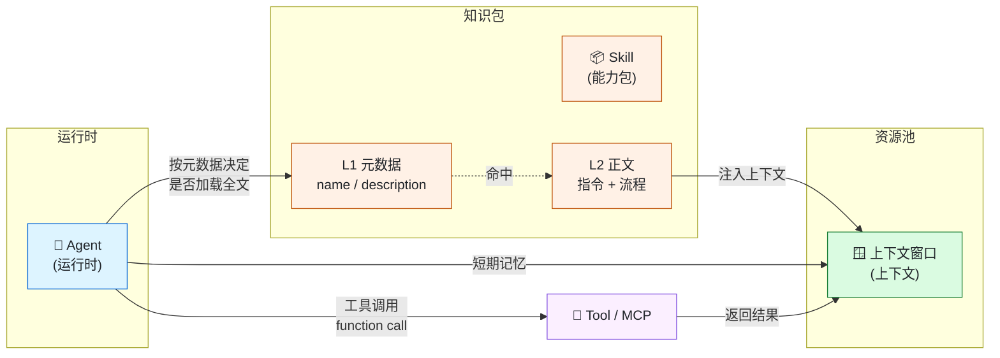
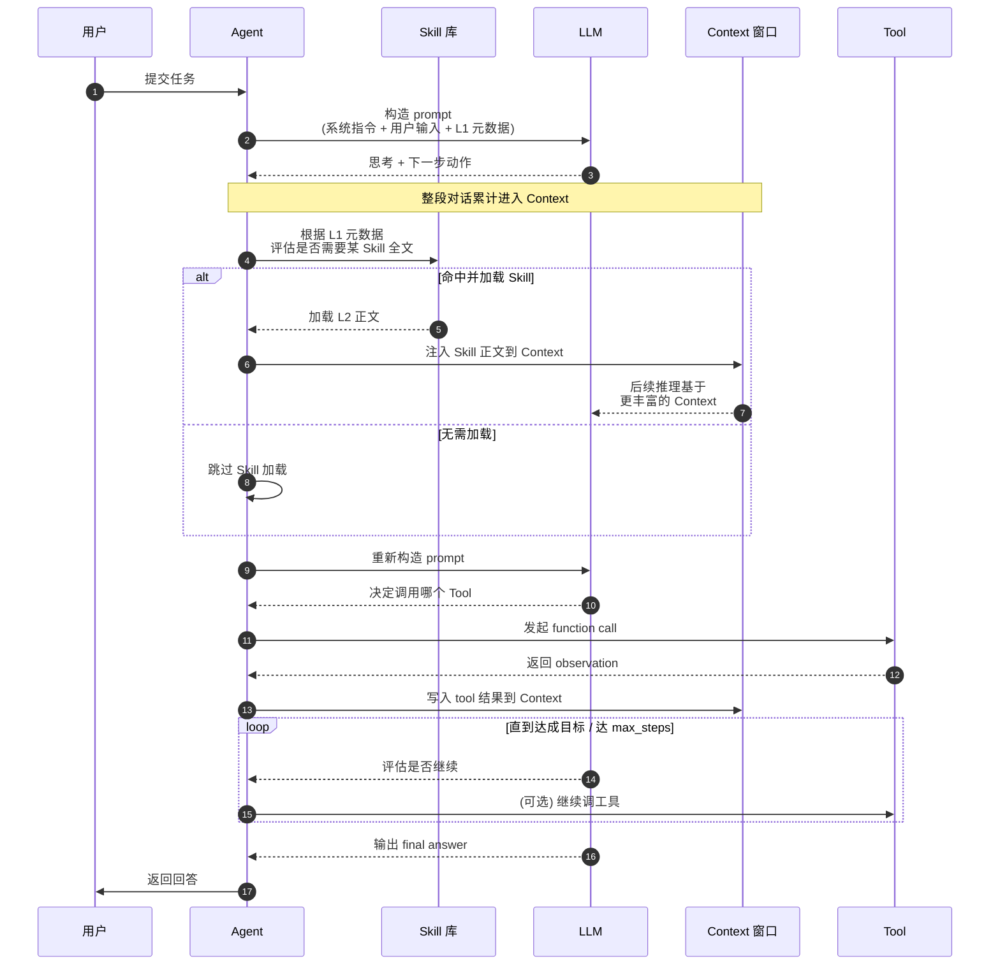
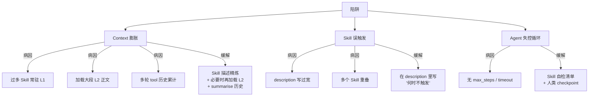

# Agent / 上下文 / Skill —— 三角关系图解

> 用 Mermaid 流程图 + 文字注解，说清楚这三者在 AI 应用栈中各自扮演什么角色，以及它们彼此如何协作与相互制约。

---

## 1. 快速回顾：三件各是什么

| 概念 | 一句话 | 核心动作 |
|------|--------|---------|
| **Agent** | 能自主感知、规划、执行多步任务的 AI 系统 | 决定"下一步做什么" |
| **上下文** | LLM 一次推理能"同时看到"的内容上限 | 决定"我此刻能记住什么" |
| **Skill** | 含元数据与指令的可复用能力包 | 决定"我该按什么流程做事" |

三件详细解释（点击展开）

- **Agent** → `learning-materials/agent.html`
- **上下文 (Context Window)** → `learning-materials/llm-context-window.html`
- **Skill** → `learning-materials/skill.html`

---

## 2. 静态结构关系

### 关键观察

- **抽象层级不同**：Agent 是"运行时"（一个正在运行的系统），Skill 是"知识包"（一份静态文档），Context 是"资源池"（一段有限容量的工作记忆）。
- **三角耦合**：
  - Agent ⇄ Context：Agent 的短期记忆 <em>就是</em>当前 context；Agent 没 context 就"失忆"。
  - Agent ⇄ Skill：Agent 根据 Skill 的 L1 元数据自主判断是否加载 L2 正文。
  - Skill → Context：Skill 内容加载进 context 后 <strong>会占 token</strong>。
- **瓶颈往往在 Context**：装太多 Skill / 走太多轮 LLM 调用都会塞满 context，触发"Lost in the Middle"现象。

---

## 3. 运行时数据流（一次完整任务）

### 流程要点

1. **L1 元数据始终在 prompt 中**：模型每轮推理都会看到所有可见 Skill 的 `name` + `description`，用来判断触发。
2. **L2 正文按需加载**：命中时把正文塞进 context；不命中就不占 token。
3. **工具调用结果写回 context**：这是 Agent"记忆自己做过什么"的关键。
4. **终止条件必须显式**：不能在 Skill 里写"任务完成就结束"，必须给 Agent 一条可观察的判据（工具返回结构 / 用户确认 / max_steps）。

---

## 4. 常见陷阱

### 4.1 Context 膨胀
- **症状**：模型"失忆"、早轮信息丢失、Lost in the Middle
- **主因**：每个可见 Skill 的 L1 都常驻在系统 prompt；L2 全文加载挤占；多轮工具返回累计
- **缓解**：精炼 L1 / 必要才加载 L2 / 历史消息定期 summarise / 工具返回做截断或转换

### 4.2 Skill 误触发
- **症状**：在不相关的任务上加载 Skill，反而拖慢质量
- **主因**：`description` 写得过于宽泛；多个 Skill 互相重叠
- **缓解**：在 `description` 中显式说明"何时 <u>不</u> 该触发"，并配反例

### 4.3 Agent 失控循环
- **症状**：Agent 反复调同一工具、卡在死循环
- **主因**：没有显式终止条件；缺少 max_steps / 单步超时
- **缓解**：Skill 里写死自检清单与终止判据；关键步骤设人类审核 checkpoint

---

## 5. 端到端走查示例

> 场景：用户在装了 `concept-learning-skill` 的 Agent 里说 —— **"帮我整理一下 RAG 的学习笔记。"**

| 步骤 | 内部动作 | Context 变化 |
|------|---------|-------------|
| ① 用户输入 | System prompt + 用户问题进入 Context | + 几十 token |
| ② L1 匹配 | LLM 读到 `concept-learning` 的 description，识别命中 | 0（description 一直都在） |
| ③ 加载 L2 | 把 `SKILL.md` 正文加载到 System 段 | + ~3K token |
| ④ 检索资料 | LLM 决定调 `web_search` 工具 | 工具描述 +100 token |
| ⑤ 工具结果 | 8 条搜索结果写入 Context | + ~2K token |
| ⑥ 反思 | LLM 决定再调 `web_search` 补充 1 条 | 又 +500 token |
| ⑦ 自检 | 按 Skill 里的"10 条自检清单"过一遍 | 0 |
| ⑧ 输出 | 输出五段式 Markdown 笔记 | 0（输出不在 Context） |

> 上面只是示意；实际值取决于检索结果长度与模型版本。**关键经验**是：步骤 ③、⑤、⑥ 这三段消耗了大量 Context，预留足够 buffer 才能避免步骤 ⑦ 自检时已经"装不下"。

---

## 6. 设计取舍速查

| 决策 | 取向 | 理由 |
|------|------|------|
| Skill 多 vs 少 | **少而精**，每个 Skill 边界清晰 | 太多 Skill 会同时占 L1 与触发歧义 |
| Skill L1 长度 | **短小**，只写到"何时触发 / 何时不触发" | L1 常驻，越长越贵 |
| Context 留白率 | **至少 30%** 留给实际对话与工具返回 | 留白太少容易触发裁剪 |
| Agent 终止条件 | **必须显式**写出可观察判据 | 不能依赖 LLM 自觉 |
| 工具返回处理 | 截断 + 关键字段保留 | 大返回挤爆 context |
| 多 Skill 协作 | 按"分级加载"组织（领域 Skill + 任务 Skill） | 避免一次性把所有正文塞进 context |
